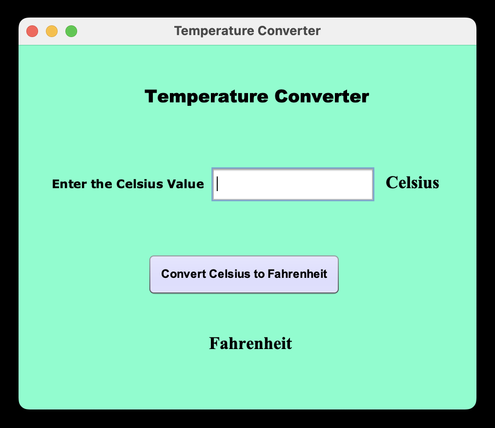
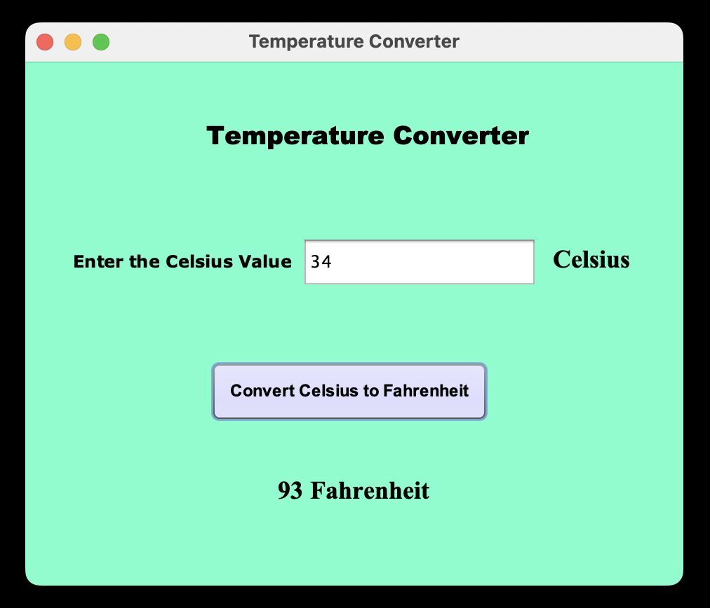

# 🌡️ Temperature Converter - Java Swing GUI

A simple Java Swing-based desktop application that allows users to **convert temperatures from Celsius to Fahrenheit** with a user-friendly graphical interface.

## 🚀 Features

- Converts **Celsius to Fahrenheit**
- Clean and intuitive GUI using **Java Swing**
- Real-time conversion output

## 📐 Conversion Formula

> Fahrenheit = (Celsius × 9/5) + 32
  
## 🖥️ Temperature Converter GUI

### 📌 Initial GUI



### ✅ Example Conversion

> **Input:** 34°C  
> **Output:** 93°F



## 🚀 How to Run

### ✅ Option 1: Clone and Run Source Code

1. Clone the repository:
    ```bash
    git clone https://github.com/hema-priya-vadivel/TemperatureConverter.git

2. Open the project in a Java IDE (e.g., IntelliJ IDEA, Eclipse)

3. Compile and run Converter.java from the src folder

4. Enter the Celsius input value and click on "Convert Celsius to Fahrenheit" button to view the converted Fahrenheit temperature value

### ✅ Option 2: Download & Run Application Directly

- [Download for Mac (.dmg)](https://github.com/hema-priya-vadivel/TemperatureConverter/blob/master/releases/download/TemperatureConverter-macOS-1.0.dmg)

